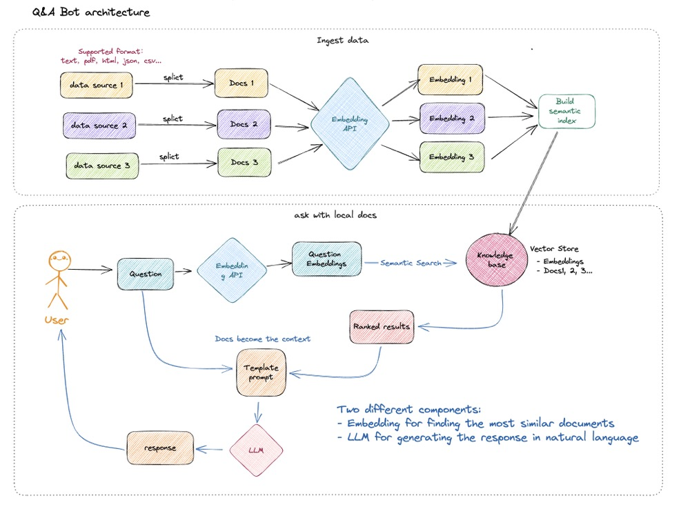

# ITT Q&A AI Bot
## Introduction
This is a local knowledge-based Q&A AI bot designed to provide information and answer questions within a specific domain or area of expertise, implemented using [RWKV-3B](https://github.com/BlinkDL/RWKV-LM) and [langchain](https://github.com/hwchase17/langchain).

The embeddings used in this project are [sentence-transformers/all-MiniLM-L6-v2](https://huggingface.co/sentence-transformers/all-MiniLM-L6-v2), and the LLM is [RWKV-3B](https://github.com/BlinkDL/RWKV-LM). Relying on these models, this project enables the use of **open-source** models for **offline private deployment**.

The implementation principle of this project is illustrated in the figure below. There're two main parts of this project, which are ingest local files to vector store and ask LLM model with the querying vector store.



This project does not involve fine-tuning or training right now; however, fine-tuning or training can be employed to optimize the effectiveness of this project.

## How to use?
### Hardware Requirements
- RWKV model hardware requirements
You can find links to model file downloads at the [RWKV-4-Raven](https://huggingface.co/BlinkDL/rwkv-4-raven/tree/main) repository.

        | Rwkv-4 models -> recommended VRAM
        | RWKV VRAM list:
        | Model | 8bit | bf16/fp16 | fp32 
        |  ----  | ----  | ---- | ---- 
        |  14B   | 16GB | 28GB      | >50GB
        | 7B    | 8GB  | 14GB      | 28GB
        | 3B    | 2.8GB| 6GB       | 12GB
        | 1b5   | 1.3GB| 3GB       | 6GB
    See the [rwkv pip](https://pypi.org/project/rwkv/) page for more information about strategies,including streaming and cuda support.
- Embedding Model Hardware requirements
   The default Embedding model [sentence-transformers/all-MiniLM-L6-v2](https://huggingface.co/sentence-transformers/all-MiniLM-L6-v2) in this project be configured to run on a CPU.
### Software Requirements
- setting up with docker 24.0.2 and Docker compose v2.18.1
### Setting up
* Environment check
```shell
# First, make sure your machine has docker and docker-compose installed
$ docker --version
Docker version 24.0.2, build cb74dfc

$ docker-compose --version
Docker Compose version v2.18.1
```
* Build the docker image and prepare models
```shell
# Clone the repository
$ git clone 
# Build the docker image
$ docker build -t qa_bot:v0.1
# Download the embedding model
$ git lfs install
$ git clone git@hf.co:sentence-transformers/all-MiniLM-L6-v2
# Download the rwkv model
$ wget https://raw.githubusercontent.com/BlinkDL/ChatRWKV/main/20B_tokenizer.json -P ./models/rwkv
$ wget https://huggingface.co/BlinkDL/rwkv-4-raven/resolve/main/RWKV-4-Raven-3B-v12-Eng49%-Chn49%-Jpn1%-Other1%-20230527-ctx4096.pth -P ./models/rwkv
# Please remember to replace the model actual path in the constants.py file.
# For better answering quality, please consider change the model to a larger one.
```
* Start the application
```shell
# run the containers
$ docker-compose up -d
```
Now the application is up and running and you can ingest local files to the vector database which is using redis.
```shell
# Example of loading .csv files
python ingest_docs.py --doc_path 'YOUR_ACTUAL_PATH/raw_docs' --redis_host 'YOUR_HOST_IP:6379' --glob "*.csv"
```
After the data ingestion, you can view the databases through redis light UI: http://YOUR_HOST_IP:8001.
* Ask your questions to the bot
The simple web UI is developed with [streamlit](https://streamlit.io/). The simple UI address: http://YOUR_HOST_IP:8501. There're two buttons for question and answering. **Ask with KB** button generates the answer integrated with the local docs as context, the other button **Ask directly** generates the answer from LLM directly.
Except for the UI, the qa API are also provided. Below is the example to request the API:
```python
def call_bot_api(
    question: str,
    api_url: Optional[str] = BOT_API_URL
    ):
    data = {
        "question": question
    }
    response = requests.post(api_url, data=json.dumps(data))
    if response.status_code == 200:
        result = response.text
        return result
    else:
        result = f"Request failed with status code: {response.status_code}"
        return result
```
API details please check the file: api.py.

## FAQ
Q1: What file formats does this project support?

A1: Currently, this project has been tested with txt, docx, html, pdf and json file formats. For more file formats, please refer to the [langchain documentation](https://python.langchain.com/en/latest/modules/indexes/document_loaders/examples/unstructured_file.html). It is known that if the document contains special characters, there might be issues with loading the file. Or you can also add more loaders when ingesting the docs.

## From author
This is a basic proof of concept (POC) for developing AI applications. While it is not flawless, there are instances where the bot may behave in a less-than-ideal manner. If you have any questions or ideas, please feel free to reach out to me. I would be delighted to engage in further discussions with you. Thank you!

